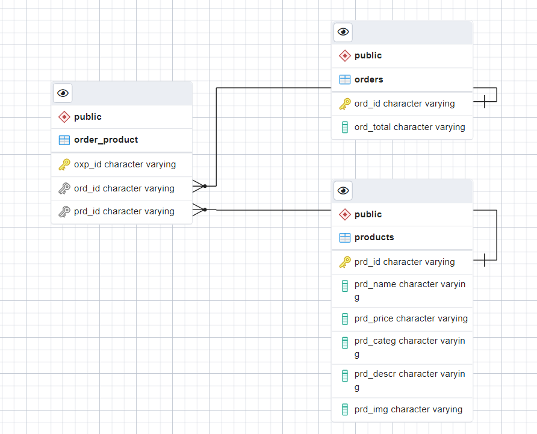

# kubo-backend

REST API developed as a **technical assessment** for Kubo Company.

Built with **NestJS**, this service provides the product and cart endpoints consumed by the frontend.

---

## ✨ Features

- 📦 Product listing & filtering endpoints
- 🛒 Shopping cart management
- ✅ Input validation with class-validator
- 🧪 Unit & e2e test setup

## 🛠️ Tech Stack

| Layer     | Technology                 |
| --------- | -------------------------- |
| Framework | NestJS                     |
| Language  | TypeScript                 |
| Database  | PostgreSQL                 |
| Runtime   | Node.js                    |
| Deploy    | Heroku (Procfile included) |

## 🗄️ Database Schema



Three tables with auto-generated prefixed IDs via PostgreSQL triggers:

**`products`** — product catalog
| Column | Type | Description |
|--------|------|-------------|
| `prd_id` | varchar | Primary key (e.g. `PRD_0`) |
| `prd_name` | varchar | Product name |
| `prd_price` | varchar | Price |
| `prd_categ` | varchar | Category |
| `prd_descr` | varchar | Description |
| `prd_img` | varchar | Image URL |

**`orders`** — customer orders
| Column | Type | Description |
|--------|------|-------------|
| `ord_id` | varchar | Primary key (e.g. `ORD_0`) |
| `ord_total` | varchar | Order total |

**`order_product`** — order ↔ product relation (many-to-many)
| Column | Type | Description |
|--------|------|-------------|
| `oxp_id` | varchar | Primary key (e.g. `OXP_0`) |
| `ord_id` | varchar | FK → orders |
| `prd_id` | varchar | FK → products |

## 🚀 Getting Started

**Prerequisites:** Node.js 16+, PostgreSQL

```bash
# Clone the repo
git clone https://github.com/mjusmar/kubo-backend.git
cd kubo-backend

# Install dependencies
npm install

# Development
npm run start:dev

# Production
npm run start:prod
```

API runs at `http://localhost:3000`

## 🧪 Testing

```bash
# Unit tests
npm run test

# e2e tests
npm run test:e2e
```

## 🔗 Related

Frontend → [kubo-front](https://github.com/mjusmar/kubo-front)
